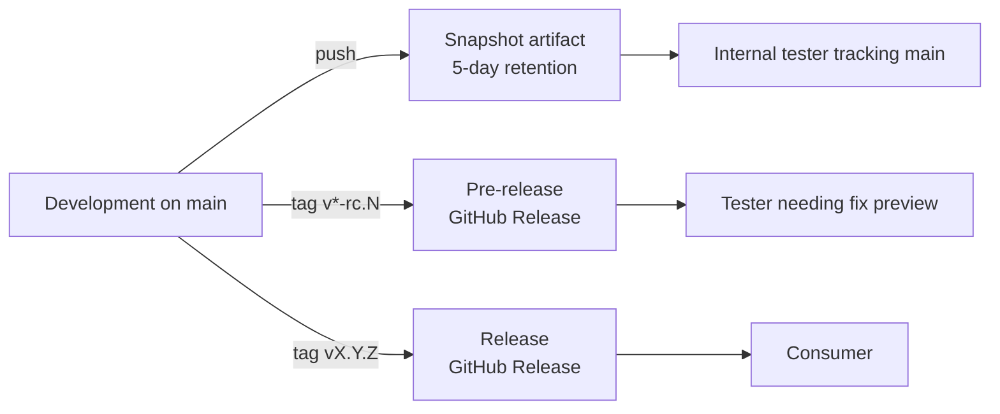
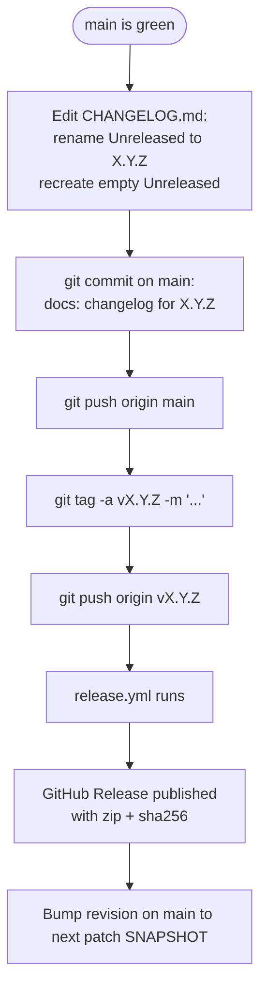

# Release Process

This document describes how to publish a release of the Hop Enhanced Parquet Plugin.

## Overview

Three distribution levels coexist:

| Level | Trigger | Mutability | Audience |
|---|---|---|---|
| Snapshot | Push to `main` | Mutable (5-day TTL) | Internal testers tracking head |
| Pre-release | Tag `vX.Y.Z-{beta,rc}.N` | Immutable | Specific testers needing a fix preview |
| Release | Tag `vX.Y.Z` | Immutable | All consumers |



Versioning follows [Semantic Versioning 2.0.0](https://semver.org/). The
`CHANGELOG.md` follows [Keep a Changelog 1.1.0](https://keepachangelog.com/),
with a **staged `[Unreleased]`** policy: feature/fix PRs add their own
entry under `[Unreleased]`; the release flow renames `[Unreleased]` to
`[X.Y.Z] - YYYY-MM-DD` and recreates an empty `[Unreleased]` above it.

## Prerequisites

- JDK 17 (Temurin recommended).
- Maven 3.9+ on `PATH`.
- All `mvn` commands in this guide must be invoked with `-s .m2/settings.xml`.
- `GITHUB_ACTOR` and `GITHUB_TOKEN` exported with `read:packages` access
  to the Apache Hop GitHub Packages feed.
- Push permission for tags on the repository.

## Snapshot artifacts

No maintainer action needed. Every push to `main` triggers the `CI`
workflow, which uploads the assembly zip as a workflow artifact named
`snapshot-<sha>` with 5-day retention.

To download:

1. Open the `Actions` tab on GitHub.
2. Select the latest run of the `CI` workflow on `main`.
3. Scroll to `Artifacts`, download `snapshot-<sha>`.

The internal zip name is `hop-parquet-plugin-<revision>.zip` (default
`hop-parquet-plugin-1.0.0-SNAPSHOT.zip`); it is uniquely identified by
the wrapping artifact's `<sha>`.

## Cutting a release



Step by step:

1. Verify `main` is green on the latest commit you intend to release from.
2. Edit `CHANGELOG.md`:
   - Rename `## [Unreleased]` to `## [X.Y.Z] - YYYY-MM-DD`.
   - Insert a new empty `## [Unreleased]` section above it.
   - Update the link references at the bottom of the file: replace the
     existing `[Unreleased]: ...compare/v<previous>...HEAD` with
     `[Unreleased]: ...compare/vX.Y.Z...HEAD`, and add a new
     `[X.Y.Z]: ...releases/tag/vX.Y.Z` line.
3. Commit directly on `main`:

   ```bash
   git add CHANGELOG.md
   git commit -m "docs: changelog for X.Y.Z"
   git push origin main
   ```

4. Tag the commit and push:

   ```bash
   git tag -a vX.Y.Z -m "Release X.Y.Z"
   git push origin vX.Y.Z
   ```

5. The `Release` workflow runs automatically. Verify on the `Actions`
   tab that it succeeds; check that the `Releases` page shows the new
   release with both `hop-parquet-plugin-X.Y.Z.zip` and
   `hop-parquet-plugin-X.Y.Z.zip.sha256` attached.
6. **For a final `vX.Y.Z` only**: bump `<revision>` on `main` to the next
   patch SNAPSHOT:

   ```bash
   # Edit pom.xml: <revision>X.Y.(Z+1)-SNAPSHOT</revision>
   git add pom.xml
   git commit -m "build: bump revision to X.Y.(Z+1)-SNAPSHOT"
   git push origin main
   ```

   For pre-releases, do **not** bump: `main` stays at `X.Y.Z-SNAPSHOT`
   until the final `X.Y.Z` ships.

## Cutting a pre-release

Pre-release identifiers in maturity order: `beta`, `rc` (`alpha` is also
accepted by the workflow regex but not currently used). Use the same
flow as a release with a tag like `v1.0.0-beta.2`. The `Release`
workflow detects the `-` in the tag and marks the GitHub Release as a
pre-release automatically.

Iteration: after `v1.0.0-beta.2`, if more fixes are needed, tag
`v1.0.0-beta.3`. Each pre-release has its own `CHANGELOG.md` section.
Tags are immutable: never reuse a tag — always iterate the suffix.

When ready, cut `v1.0.0` (no suffix). Its CHANGELOG section consolidates
the user-facing changes since the previous final release (or since the
beginning of the project, for the first GA).

## Verifying locally

Before tagging, validate the release-mode build locally:

```bash
mvn -B -Drevision=X.Y.Z clean package -s .m2/settings.xml
ls assemblies/assemblies-parquet-enhanced/target/hop-parquet-plugin-X.Y.Z.zip
```

The artifact name should match `hop-parquet-plugin-X.Y.Z.zip`.

## Hotfix release

To patch a previous minor while `main` has moved on:

1. Branch from the past tag:

   ```bash
   git checkout -b hotfix/X.Y.(Z+1) vX.Y.Z
   ```

2. Apply the fix, commit, push.
3. Update `CHANGELOG.md` on the hotfix branch with a `## [X.Y.(Z+1)]` section.
4. Tag from the hotfix branch:

   ```bash
   git tag -a vX.Y.(Z+1) -m "Hotfix X.Y.(Z+1)"
   git push origin vX.Y.(Z+1)
   ```

5. The `Release` workflow runs as usual.
6. Cherry-pick the fix back to `main` if applicable, and add the
   `## [X.Y.(Z+1)]` section to `main`'s `CHANGELOG.md` so the running
   history is complete.

## Rollback / yank

A published GitHub Release is **not** deleted. To withdraw a buggy
release, ship a follow-up patch (`X.Y.(Z+1)`) with the fix and update
`CHANGELOG.md` to call out the regression. Optionally edit the GitHub
Release description of the bad version to point to the fix release; do
not remove the asset.

## Troubleshooting

- **Workflow fails on `Validate SemVer tag`**: the tag does not match
  `vMAJOR.MINOR.PATCH(-{alpha,beta,rc}.N)?`. Delete the tag locally and
  on the remote (`git tag -d vX.Y.Z && git push origin :refs/tags/vX.Y.Z`),
  retag correctly.
- **Workflow fails on `Extract changelog section`**: there is no
  `## [VERSION]` heading in `CHANGELOG.md`. Add it on `main`, push,
  delete the misplaced tag, retag on the new commit.
- **Tag pushed on the wrong commit**: if a Release was already created,
  delete it on the GitHub Releases page first; then
  `git push origin :refs/tags/vX.Y.Z`, retag on the right commit, push.
- **`flatten-maven-plugin` leaves `.flattened-pom.xml` files**:
  these are in `.gitignore`; safe to ignore. `mvn clean` removes them.
- **Maven cannot resolve `org.apache.hop:*` artifacts**: confirm
  `GITHUB_ACTOR` / `GITHUB_TOKEN` are exported and that
  `-s .m2/settings.xml` is on the command line.

## Reference

- POM CI Friendly Versions: `pom.xml` (`<revision>` property,
  `flatten-maven-plugin`).
- Workflows: `.github/workflows/ci.yml`, `.github/workflows/release.yml`.
- Changelog file: `CHANGELOG.md` (Keep a Changelog 1.1.0, staged
  `[Unreleased]` policy).
- Maven settings: `.m2/settings.xml` (GitHub Packages credentials).
