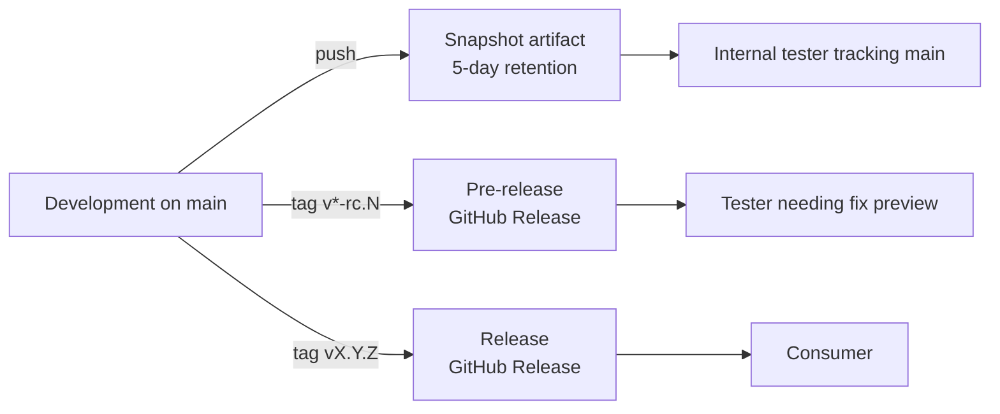
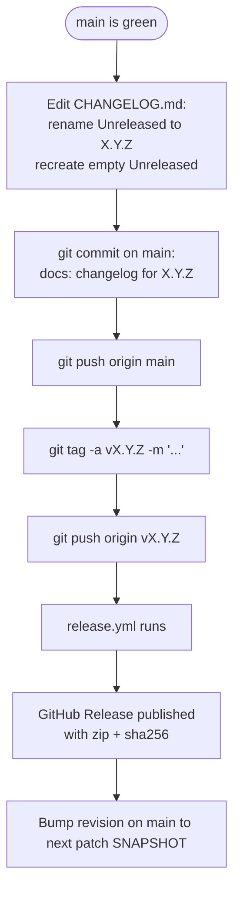

# Release Management Alignment Implementation Plan

> **For agentic workers:** REQUIRED SUB-SKILL: Use superpowers:subagent-driven-development (recommended) or superpowers:executing-plans to implement this plan task-by-task. Steps use checkbox (`- [ ]`) syntax for tracking.

**Goal:** Align release management with the model used in `hop-process-template-plugins`: Maven `${revision}`, two GitHub workflows (`ci.yml` + `release.yml`), `CHANGELOG.md` (Keep-a-Changelog), operator guide, and updated `CLAUDE.md` Serena rules.

**Architecture:** Replace hardcoded `1.0.0-SNAPSHOT` across four POMs with the Maven *CI Friendly Versions* property `${revision}`, defaulted to `1.0.0-SNAPSHOT` in the root POM and overridable from the command line via `-Drevision=X.Y.Z`. The release workflow injects the version from the git tag, extracts the corresponding section from `CHANGELOG.md`, builds the assembly, computes a SHA-256, and publishes a GitHub Release (marked pre-release if the tag has a `-` suffix).

**Tech Stack:** Maven 3.9+ (CI Friendly Versions, `flatten-maven-plugin`), GitHub Actions, JDK 17 Temurin, Apache Hop 2.16.2, Keep-a-Changelog 1.1.0.

**Spec:** `docs/superpowers/specs/2026-05-01-release-management-alignment-design.md`

**Branch:** `chore/release-management-alignment` (already created and contains the spec commit).

---

## File Structure

| File | Action | Responsibility |
|---|---|---|
| `pom.xml` | Modify | Add `<revision>` property, switch `<version>` to `${revision}`, declare `flatten-maven-plugin` in `<pluginManagement>` and `<build><plugins>` |
| `transforms/pom.xml` | Modify | Switch own and parent `<version>` to `${revision}` |
| `transforms/parquet-enhanced/pom.xml` | Modify | Add explicit `<version>${revision}</version>` (overrides Hop parent's 2.16.2) |
| `assemblies/pom.xml` | Modify | Switch own and parent `<version>` to `${revision}` |
| `assemblies/assemblies-parquet-enhanced/pom.xml` | Modify | Switch parent `<version>` to `${revision}`, drop `plugin.version` property, use `${project.version}` in `<finalName>` and dependency version |
| `.gitignore` | Modify | Add `.flattened-pom.xml` |
| `.github/workflows/pr-build.yml` | Delete | Replaced by `ci.yml` |
| `.github/workflows/ci.yml` | Create | PR + push-on-main build with snapshot artifact upload |
| `.github/workflows/release.yml` | Rewrite | Tag-driven release with SemVer validation, `${revision}` injection, changelog extraction, sha256, prerelease detection |
| `CHANGELOG.md` | Create | Keep-a-Changelog 1.1.0 with `[Unreleased]` and retroactive `[1.0.0-beta.1]` |
| `docs/guides/tech/release-process.md` | Create | Operator guide adapted from template |
| `CLAUDE.md` | Modify | Replace "Tools and References" with expanded Serena rules; add changelog item to Task Completion Checklist |

---

## Task 0: Create GitHub Issues and confirm working branch

**Files:** none.

- [ ] **Step 1: Confirm we are on the dedicated branch**

Run:

```bash
git branch --show-current
```

Expected: `chore/release-management-alignment`

If the output is something else, run `git checkout chore/release-management-alignment` (the branch exists from the brainstorming step).

- [ ] **Step 2: Create the six GitHub Issues**

Run each command and capture the issue numbers printed by `gh` (write them down — they are referenced in the final PR body):

```bash
gh issue create --title "Adopt Maven CI Friendly Versions in POMs" --body "Adottare la proprietà \`\${revision}\` (default \`1.0.0-SNAPSHOT\` in root POM) e configurare \`flatten-maven-plugin\` per produrre POM deployabili con \`\${revision}\` risolto. Allineamento al modello di hop-process-template-plugins."
gh issue create --title "Replace pr-build.yml with ci.yml aligned to template" --body "Sostituire \`.github/workflows/pr-build.yml\` con un nuovo \`.github/workflows/ci.yml\` allineato a hop-process-template-plugins: trigger su PR e push su main, build con \`mvn -B clean verify\`, upload dello snapshot artifact con retention 5 giorni sui push su main."
gh issue create --title "Rewrite release.yml with SemVer validation and changelog extraction" --body "Riscrivere \`.github/workflows/release.yml\` allineandolo al modello di hop-process-template-plugins: validazione SemVer del tag, build con \`-Drevision=\${VERSION}\`, estrazione della sezione changelog corrispondente, calcolo sha256, rilevamento automatico pre-release, pubblicazione GitHub Release con asset zip + sha256."
gh issue create --title "Add CHANGELOG.md (Keep-a-Changelog) with retroactive [1.0.0-beta.1]" --body "Introdurre \`CHANGELOG.md\` in formato Keep-a-Changelog 1.1.0 con sezione \`[Unreleased]\` vuota e una sezione retroattiva \`[1.0.0-beta.1]\` ricostruita dalla cronologia commit. Nessun tag retroattivo: la prossima release con il nuovo modello sarà decisa dal manutentore."
gh issue create --title "Add release process guide at docs/guides/tech/release-process.md" --body "Aggiungere la guida operativa di rilascio in \`docs/guides/tech/release-process.md\`, adattata da hop-process-template-plugins: overview con tabella dei livelli di distribuzione, prerequisiti, snapshot, cutting di release/pre-release/hotfix, verifica locale, rollback, troubleshooting."
gh issue create --title "Update CLAUDE.md with expanded Serena rules" --body "Estendere la sezione \"Tools and References\" di \`CLAUDE.md\` con le regole Serena del template: preferenza per i tool simbolici, attivazione a inizio sessione, ripetizione verbatim della direttiva nei prompt di dispatch dei subagent, ciclo activate-query-deactivate per consultare \`hop-serasoft\` (read-only). Aggiungere voce alla Task Completion Checklist sull'aggiornamento di \`CHANGELOG.md\` per i cambi utente-visibili."
```

Expected: each command prints a URL ending in `/issues/<N>`. Note all six numbers.

- [ ] **Step 3: Record issue numbers**

Create a temporary scratch note (not committed) so they are easy to reuse in the final PR body. Example:

```
ISSUES:
  POM revision         -> #
  ci.yml               -> #
  release.yml          -> #
  CHANGELOG.md         -> #
  release-process guide-> #
  CLAUDE.md Serena     -> #
```

---

## Task 1: Adopt `${revision}` and `flatten-maven-plugin` in root POM

**Files:**
- Modify: `pom.xml`

- [ ] **Step 1: Add `<revision>` property**

Edit `pom.xml`. Inside `<properties>`, immediately after `<hop.version>2.16.2</hop.version>` (line 18), insert:

```xml
        <!-- CI Friendly Versions: overridable from CLI with -Drevision=X.Y.Z -->
        <revision>1.0.0-SNAPSHOT</revision>
        <flatten-maven-plugin.version>1.6.0</flatten-maven-plugin.version>
```

- [ ] **Step 2: Switch project version to `${revision}`**

In the same `pom.xml`, replace line 10:

```xml
    <version>1.0.0-SNAPSHOT</version>
```

with:

```xml
    <version>${revision}</version>
```

- [ ] **Step 3: Declare `flatten-maven-plugin` in pluginManagement**

In `pom.xml`, inside `<build><pluginManagement><plugins>`, after the `jandex-maven-plugin` block (around line 179), append:

```xml
                <plugin>
                    <groupId>org.codehaus.mojo</groupId>
                    <artifactId>flatten-maven-plugin</artifactId>
                    <version>${flatten-maven-plugin.version}</version>
                </plugin>
```

- [ ] **Step 4: Activate `flatten-maven-plugin` in build/plugins**

In `pom.xml`, inside `<build><plugins>`, after the `jandex-maven-plugin` execution block (around line 203), append:

```xml
            <plugin>
                <groupId>org.codehaus.mojo</groupId>
                <artifactId>flatten-maven-plugin</artifactId>
                <configuration>
                    <updatePomFile>true</updatePomFile>
                    <flattenMode>resolveCiFriendliesOnly</flattenMode>
                </configuration>
                <executions>
                    <execution>
                        <id>flatten</id>
                        <phase>process-resources</phase>
                        <goals>
                            <goal>flatten</goal>
                        </goals>
                    </execution>
                    <execution>
                        <id>flatten.clean</id>
                        <phase>clean</phase>
                        <goals>
                            <goal>clean</goal>
                        </goals>
                    </execution>
                </executions>
            </plugin>
```

- [ ] **Step 5: Verify root POM still parses**

Run:

```bash
mvn -N -s .m2/settings.xml -q help:evaluate -Dexpression=project.version -DforceStdout
```

Expected: prints `1.0.0-SNAPSHOT` (no Maven errors). `GITHUB_ACTOR` and `GITHUB_TOKEN` must be exported.

- [ ] **Step 6: Verify override works**

Run:

```bash
mvn -N -s .m2/settings.xml -q help:evaluate -Dexpression=project.version -DforceStdout -Drevision=9.9.9
```

Expected: prints `9.9.9`.

- [ ] **Step 7: Commit**

```bash
git add pom.xml
git commit -m "build: adopt Maven CI Friendly Versions in root POM"
```

---

## Task 2: Propagate `${revision}` to module POMs

**Files:**
- Modify: `transforms/pom.xml`
- Modify: `transforms/parquet-enhanced/pom.xml`
- Modify: `assemblies/pom.xml`
- Modify: `assemblies/assemblies-parquet-enhanced/pom.xml`

- [ ] **Step 1: Update `transforms/pom.xml`**

Replace both occurrences of `<version>1.0.0-SNAPSHOT</version>` (the project's own and the parent's) with `<version>${revision}</version>`. The file should look like:

```xml
<?xml version="1.0" encoding="UTF-8"?>
<project xmlns="http://maven.apache.org/POM/4.0.0" xmlns:xsi="http://www.w3.org/2001/XMLSchema-instance"
         xsi:schemaLocation="http://maven.apache.org/POM/4.0.0 http://maven.apache.org/xsd/maven-4.0.0.xsd">
  <modelVersion>4.0.0</modelVersion>

  <groupId>org.apache.hop</groupId>
  <artifactId>hop-parquet-transforms</artifactId>
  <version>${revision}</version>
  <packaging>pom</packaging>

  <name>Hop Parquet Transforms</name>

  <parent>
    <groupId>org.apache.hop</groupId>
    <artifactId>hop-parquet-plugin</artifactId>
    <version>${revision}</version>
  </parent>

  <modules>
    <module>parquet-enhanced</module>
  </modules>

</project>
```

- [ ] **Step 2: Add explicit `${revision}` version to `transforms/parquet-enhanced/pom.xml`**

The current file has parent `org.apache.hop:hop:2.16.2` (Apache Hop) and no own version, so the artifact gets built as `parquet-enhanced-2.16.2.jar`. Add an explicit version so it follows `${revision}`. After the `<parent>` block (around line 10) and before `<artifactId>parquet-enhanced</artifactId>`, insert:

```xml
    <artifactId>parquet-enhanced</artifactId>
    <version>${revision}</version>
```

(replace the existing `<artifactId>parquet-enhanced</artifactId>` line with the two lines above). Also add the `<revision>` property in `<properties>` so the module resolves it when built standalone:

In the `<properties>` block (around line 14), after `<checkstyle.skip>true</checkstyle.skip>`, insert:

```xml
        <revision>1.0.0-SNAPSHOT</revision>
```

- [ ] **Step 3: Update `assemblies/pom.xml`**

Replace both `<version>1.0.0-SNAPSHOT</version>` (project's own and parent's) with `<version>${revision}</version>`. Result:

```xml
  <artifactId>hop-parquet-assemblies</artifactId>
  <version>${revision}</version>
  <packaging>pom</packaging>

  <name>Hop Parquet Enhanced Assemblies</name>

  <parent>
    <groupId>org.apache.hop</groupId>
    <artifactId>hop-parquet-plugin</artifactId>
    <version>${revision}</version>
  </parent>
```

- [ ] **Step 4: Update `assemblies/assemblies-parquet-enhanced/pom.xml`**

Three changes:

a) Parent block (lines 5-9): change parent `<version>1.0.0-SNAPSHOT</version>` to `<version>${revision}</version>`.

b) Replace the `<properties>` block (lines 15-17):

```xml
    <properties>
        <plugin.version>2.16.2</plugin.version>
    </properties>
```

with:

```xml
    <properties>
    </properties>
```

(or remove the block entirely if no other property is needed — leave it empty as a placeholder for future use).

c) In the dependency on `parquet-enhanced` (lines 20-24), change `<version>${plugin.version}</version>` to `<version>${project.version}</version>`.

d) In the `<finalName>` (line 134), change `hop-parquet-plugin-${plugin.version}` to `hop-parquet-plugin-${project.version}`.

- [ ] **Step 5: Add `.flattened-pom.xml` to `.gitignore`**

Append to `.gitignore` at the end of the file:

```
.flattened-pom.xml
```

- [ ] **Step 6: Full build verification at default revision**

Run:

```bash
mvn -B clean verify -s .m2/settings.xml
```

Expected: BUILD SUCCESS. The assembly is produced at `assemblies/assemblies-parquet-enhanced/target/hop-parquet-plugin-1.0.0-SNAPSHOT.zip`.

Verify:

```bash
ls assemblies/assemblies-parquet-enhanced/target/hop-parquet-plugin-1.0.0-SNAPSHOT.zip
```

Expected: file exists.

- [ ] **Step 7: Build verification with revision override**

Run:

```bash
mvn -B -Drevision=9.9.9 clean package -s .m2/settings.xml
ls assemblies/assemblies-parquet-enhanced/target/hop-parquet-plugin-9.9.9.zip
```

Expected: BUILD SUCCESS and the file `hop-parquet-plugin-9.9.9.zip` exists.

If either build fails, fix the POM error before proceeding (most likely culprits: a `${plugin.version}` reference left somewhere, or a missed `1.0.0-SNAPSHOT`).

- [ ] **Step 8: Clean leftover artifacts**

```bash
mvn -B clean -s .m2/settings.xml
```

- [ ] **Step 9: Commit**

```bash
git add transforms/pom.xml transforms/parquet-enhanced/pom.xml assemblies/pom.xml assemblies/assemblies-parquet-enhanced/pom.xml .gitignore
git commit -m "build: propagate \${revision} to module POMs and assembly"
```

---

## Task 3: Replace `pr-build.yml` with `ci.yml`

**Files:**
- Delete: `.github/workflows/pr-build.yml`
- Create: `.github/workflows/ci.yml`

- [ ] **Step 1: Create `ci.yml`**

Create `.github/workflows/ci.yml` with this exact content:

```yaml
name: CI

on:
  pull_request:
    branches: [main]
  push:
    branches: [main]

jobs:
  build:
    runs-on: ubuntu-latest

    steps:
      - name: Checkout
        uses: actions/checkout@v4

      - name: Set up JDK 17
        uses: actions/setup-java@v4
        with:
          java-version: '17'
          distribution: 'temurin'

      - name: Build and Verify
        env:
          GITHUB_ACTOR: ${{ github.actor }}
          GITHUB_TOKEN: ${{ secrets.GITHUB_TOKEN }}
        run: mvn -B clean verify -s .m2/settings.xml

      - name: Upload snapshot artifact
        if: github.event_name == 'push' && github.ref == 'refs/heads/main'
        uses: actions/upload-artifact@v4
        with:
          name: snapshot-${{ github.sha }}
          path: assemblies/assemblies-parquet-enhanced/target/hop-parquet-plugin-*.zip
          retention-days: 5
          if-no-files-found: error
```

- [ ] **Step 2: Delete `pr-build.yml`**

```bash
git rm .github/workflows/pr-build.yml
```

- [ ] **Step 3: Lint YAML locally**

Run:

```bash
python3 -c "import yaml; yaml.safe_load(open('.github/workflows/ci.yml'))"
```

Expected: no output, exit code 0.

- [ ] **Step 4: Commit**

```bash
git add .github/workflows/ci.yml
git commit -m "ci: replace pr-build.yml with ci.yml aligned to template"
```

---

## Task 4: Rewrite `release.yml`

**Files:**
- Modify (full rewrite): `.github/workflows/release.yml`

- [ ] **Step 1: Replace the file content**

Overwrite `.github/workflows/release.yml` with this exact content:

```yaml
name: Release

on:
  push:
    tags:
      - 'v[0-9]+.[0-9]+.[0-9]+*'

jobs:
  release:
    runs-on: ubuntu-latest

    steps:
      - name: Checkout
        uses: actions/checkout@v4

      - name: Validate SemVer tag
        run: |
          TAG="${GITHUB_REF_NAME}"
          if [[ ! "$TAG" =~ ^v[0-9]+\.[0-9]+\.[0-9]+(-(alpha|beta|rc)\.[0-9]+)?$ ]]; then
            echo "::error::Tag '$TAG' is not a valid SemVer release/pre-release tag (expected vMAJOR.MINOR.PATCH or vMAJOR.MINOR.PATCH-{alpha,beta,rc}.N)." >&2
            exit 1
          fi

      - name: Set up JDK 17
        uses: actions/setup-java@v4
        with:
          java-version: '17'
          distribution: 'temurin'

      - name: Get version from tag
        id: version
        run: echo "VERSION=${GITHUB_REF_NAME#v}" >> "$GITHUB_OUTPUT"

      - name: Build with Maven
        env:
          GITHUB_ACTOR: ${{ github.actor }}
          GITHUB_TOKEN: ${{ secrets.GITHUB_TOKEN }}
        run: mvn -B -Drevision=${{ steps.version.outputs.VERSION }} clean package -s .m2/settings.xml

      - name: Extract changelog section
        id: changelog
        run: |
          VERSION="${{ steps.version.outputs.VERSION }}"
          if [ ! -f CHANGELOG.md ]; then
            echo "::error::CHANGELOG.md not found." >&2
            exit 1
          fi
          section=$(awk -v hdr="## [$VERSION]" '
            index($0, hdr) == 1 { flag=1; next }
            flag && (/^## \[/ || /^\[[^]]+\]: /) { exit }
            flag { print }
          ' CHANGELOG.md)
          if [ -z "$(echo "$section" | tr -d '[:space:]')" ]; then
            echo "::error::No CHANGELOG section found for version $VERSION." >&2
            exit 1
          fi
          {
            echo "body<<CHANGELOG_EOF"
            echo "## Changelog"
            echo ""
            echo "$section"
            echo "CHANGELOG_EOF"
          } >> "$GITHUB_OUTPUT"

      - name: Compute sha256
        run: |
          cd assemblies/assemblies-parquet-enhanced/target
          sha256sum "hop-parquet-plugin-${{ steps.version.outputs.VERSION }}.zip" \
            > "hop-parquet-plugin-${{ steps.version.outputs.VERSION }}.zip.sha256"

      - name: Create GitHub Release
        uses: softprops/action-gh-release@v2
        with:
          files: |
            assemblies/assemblies-parquet-enhanced/target/hop-parquet-plugin-${{ steps.version.outputs.VERSION }}.zip
            assemblies/assemblies-parquet-enhanced/target/hop-parquet-plugin-${{ steps.version.outputs.VERSION }}.zip.sha256
          generate_release_notes: true
          prerelease: ${{ contains(github.ref_name, '-') }}
          body: ${{ steps.changelog.outputs.body }}
        env:
          GITHUB_TOKEN: ${{ secrets.GITHUB_TOKEN }}
```

- [ ] **Step 2: Lint YAML**

```bash
python3 -c "import yaml; yaml.safe_load(open('.github/workflows/release.yml'))"
```

Expected: no output, exit code 0.

- [ ] **Step 3: Commit**

```bash
git add .github/workflows/release.yml
git commit -m "ci: rewrite release workflow with SemVer validation and changelog extraction"
```

---

## Task 5: Add `CHANGELOG.md`

**Files:**
- Create: `CHANGELOG.md`

- [ ] **Step 1: Create `CHANGELOG.md` at repo root**

Use this exact content. Replace `2026-05-01` only if today's date is different (it should match the implementation date, not the past commit dates).

```markdown
# Changelog

All notable changes to this project are documented in this file.

The format is based on [Keep a Changelog 1.1.0](https://keepachangelog.com/en/1.1.0/) and this project adheres to [Semantic Versioning 2.0.0](https://semver.org/).

Under `[Unreleased]`, every pull request that introduces a user-visible change adds an entry to the appropriate category (`Added`, `Changed`, `Fixed`, `Removed`, `Deprecated`, `Security`). When a release is cut, the release PR renames `[Unreleased]` to `[<version>] - YYYY-MM-DD` and creates a new empty `[Unreleased]` section above it.

## [Unreleased]

## [1.0.0-beta.1] - 2026-05-01

### Added

- `ParquetInputEnhanced` transform: reads one or more Parquet files via Apache Commons VFS, with a Files tab supporting explicit file lists and "Accept filenames from previous transform" mode.
- `ParquetOutputEnhanced` transform: writes Parquet files with configurable compression and schema derived from the incoming row metadata.
- Unit tests for `ParquetField`, `ParquetRecordMaterializer`, `ParquetWriteSupport` (type dispatch and null handling), `ParquetValueConverter`, `ParquetInputStream`, `buildFilename`, `getFields`, and `ParquetOutputEnhancedMeta` copy constructor.

### Changed

- README expanded with detailed project description, features, and setup instructions.
- GitHub Actions upgraded to Node.js 24 compatible versions.
- Aligned with upstream Apache Hop changes from issues #5730 and #5947.

### Fixed

- NPE when "Accept filenames from previous transform" was used in `ParquetInputEnhanced`.
- Shallow copy bug in `ParquetOutputEnhancedMeta` copy constructor.
- Multiple bugs in `ParquetInputStream` surfaced by the new unit tests.
- Conversion bugs in `ParquetValueConverter`.
- `ParquetVersion` fallback path and `ParquetOutputStream` position tracking.
- Fields tab sort error caused by an incorrect `ColumnInfo` constructor invocation.
- File lock on Windows caused by VFS `FileObject` not being closed after reading the file into memory.
- Cancel on the dialog marking the pipeline as modified, by saving and restoring the changed state.

[Unreleased]: https://github.com/serasoft-srl/hop-parquet-plugin-enhanced/compare/v1.0.0-beta.1...HEAD
[1.0.0-beta.1]: https://github.com/serasoft-srl/hop-parquet-plugin-enhanced/releases/tag/v1.0.0-beta.1
```

- [ ] **Step 2: Verify the GitHub repository slug in the link references**

Run:

```bash
git remote get-url origin
```

If the URL is **not** `https://github.com/serasoft-srl/hop-parquet-plugin-enhanced.git` (or the SSH equivalent `git@github.com:serasoft-srl/...`), update the two `[Unreleased]` and `[1.0.0-beta.1]` link lines at the bottom of `CHANGELOG.md` to use the correct `<owner>/<repo>` slug.

- [ ] **Step 3: Smoke-test the changelog extraction logic locally**

This mirrors the awk script used by `release.yml` and proves a pre-release version like `1.0.0-beta.1` can be extracted:

```bash
awk -v hdr="## [1.0.0-beta.1]" '
  index($0, hdr) == 1 { flag=1; next }
  flag && (/^## \[/ || /^\[[^]]+\]: /) { exit }
  flag { print }
' CHANGELOG.md
```

Expected: prints the body of the `[1.0.0-beta.1]` section (Added/Changed/Fixed). If output is empty, the heading does not match — fix it.

- [ ] **Step 4: Commit**

```bash
git add CHANGELOG.md
git commit -m "docs: add CHANGELOG.md in Keep-a-Changelog format with retroactive 1.0.0-beta.1"
```

---

## Task 6: Add `docs/guides/tech/release-process.md`

**Files:**
- Create: `docs/guides/tech/release-process.md`

- [ ] **Step 1: Create the directory**

```bash
mkdir -p docs/guides/tech
```

- [ ] **Step 2: Write the guide**

Create `docs/guides/tech/release-process.md` with this exact content:

````markdown
# Release Process

This document describes how to publish a release of the Hop Enhanced Parquet Plugin.

## Overview

Three distribution levels coexist:

| Level | Trigger | Mutability | Audience |
|---|---|---|---|
| Snapshot | Push to `main` | Mutable (5-day TTL) | Internal testers tracking head |
| Pre-release | Tag `vX.Y.Z-{beta,rc}.N` | Immutable | Specific testers needing a fix preview |
| Release | Tag `vX.Y.Z` | Immutable | All consumers |



Versioning follows [Semantic Versioning 2.0.0](https://semver.org/). The
`CHANGELOG.md` follows [Keep a Changelog 1.1.0](https://keepachangelog.com/),
with a **staged `[Unreleased]`** policy: feature/fix PRs add their own
entry under `[Unreleased]`; the release flow renames `[Unreleased]` to
`[X.Y.Z] - YYYY-MM-DD` and recreates an empty `[Unreleased]` above it.

## Prerequisites

- JDK 17 (Temurin recommended).
- Maven 3.9+ on `PATH`.
- All `mvn` commands in this guide must be invoked with `-s .m2/settings.xml`.
- `GITHUB_ACTOR` and `GITHUB_TOKEN` exported with `read:packages` access
  to the Apache Hop GitHub Packages feed.
- Push permission for tags on the repository.

## Snapshot artifacts

No maintainer action needed. Every push to `main` triggers the `CI`
workflow, which uploads the assembly zip as a workflow artifact named
`snapshot-<sha>` with 5-day retention.

To download:

1. Open the `Actions` tab on GitHub.
2. Select the latest run of the `CI` workflow on `main`.
3. Scroll to `Artifacts`, download `snapshot-<sha>`.

The internal zip name is `hop-parquet-plugin-<revision>.zip` (default
`hop-parquet-plugin-1.0.0-SNAPSHOT.zip`); it is uniquely identified by
the wrapping artifact's `<sha>`.

## Cutting a release



Step by step:

1. Verify `main` is green on the latest commit you intend to release from.
2. Edit `CHANGELOG.md`:
   - Rename `## [Unreleased]` to `## [X.Y.Z] - YYYY-MM-DD`.
   - Insert a new empty `## [Unreleased]` section above it.
   - Update the link references at the bottom of the file: replace the
     existing `[Unreleased]: ...compare/v<previous>...HEAD` with
     `[Unreleased]: ...compare/vX.Y.Z...HEAD`, and add a new
     `[X.Y.Z]: ...releases/tag/vX.Y.Z` line.
3. Commit directly on `main`:

   ```bash
   git add CHANGELOG.md
   git commit -m "docs: changelog for X.Y.Z"
   git push origin main
   ```

4. Tag the commit and push:

   ```bash
   git tag -a vX.Y.Z -m "Release X.Y.Z"
   git push origin vX.Y.Z
   ```

5. The `Release` workflow runs automatically. Verify on the `Actions`
   tab that it succeeds; check that the `Releases` page shows the new
   release with both `hop-parquet-plugin-X.Y.Z.zip` and
   `hop-parquet-plugin-X.Y.Z.zip.sha256` attached.
6. **For a final `vX.Y.Z` only**: bump `<revision>` on `main` to the next
   patch SNAPSHOT:

   ```bash
   # Edit pom.xml: <revision>X.Y.(Z+1)-SNAPSHOT</revision>
   git add pom.xml
   git commit -m "build: bump revision to X.Y.(Z+1)-SNAPSHOT"
   git push origin main
   ```

   For pre-releases, do **not** bump: `main` stays at `X.Y.Z-SNAPSHOT`
   until the final `X.Y.Z` ships.

## Cutting a pre-release

Pre-release identifiers in maturity order: `beta`, `rc` (`alpha` is also
accepted by the workflow regex but not currently used). Use the same
flow as a release with a tag like `v1.0.0-beta.2`. The `Release`
workflow detects the `-` in the tag and marks the GitHub Release as a
pre-release automatically.

Iteration: after `v1.0.0-beta.2`, if more fixes are needed, tag
`v1.0.0-beta.3`. Each pre-release has its own `CHANGELOG.md` section.
Tags are immutable: never reuse a tag — always iterate the suffix.

When ready, cut `v1.0.0` (no suffix). Its CHANGELOG section consolidates
the user-facing changes since the previous final release (or since the
beginning of the project, for the first GA).

## Verifying locally

Before tagging, validate the release-mode build locally:

```bash
mvn -B -Drevision=X.Y.Z clean package -s .m2/settings.xml
ls assemblies/assemblies-parquet-enhanced/target/hop-parquet-plugin-X.Y.Z.zip
```

The artifact name should match `hop-parquet-plugin-X.Y.Z.zip`.

## Hotfix release

To patch a previous minor while `main` has moved on:

1. Branch from the past tag:

   ```bash
   git checkout -b hotfix/X.Y.(Z+1) vX.Y.Z
   ```

2. Apply the fix, commit, push.
3. Update `CHANGELOG.md` on the hotfix branch with a `## [X.Y.(Z+1)]` section.
4. Tag from the hotfix branch:

   ```bash
   git tag -a vX.Y.(Z+1) -m "Hotfix X.Y.(Z+1)"
   git push origin vX.Y.(Z+1)
   ```

5. The `Release` workflow runs as usual.
6. Cherry-pick the fix back to `main` if applicable, and add the
   `## [X.Y.(Z+1)]` section to `main`'s `CHANGELOG.md` so the running
   history is complete.

## Rollback / yank

A published GitHub Release is **not** deleted. To withdraw a buggy
release, ship a follow-up patch (`X.Y.(Z+1)`) with the fix and update
`CHANGELOG.md` to call out the regression. Optionally edit the GitHub
Release description of the bad version to point to the fix release; do
not remove the asset.

## Troubleshooting

- **Workflow fails on `Validate SemVer tag`**: the tag does not match
  `vMAJOR.MINOR.PATCH(-{alpha,beta,rc}.N)?`. Delete the tag locally and
  on the remote (`git tag -d vX.Y.Z && git push origin :refs/tags/vX.Y.Z`),
  retag correctly.
- **Workflow fails on `Extract changelog section`**: there is no
  `## [VERSION]` heading in `CHANGELOG.md`. Add it on `main`, push,
  delete the misplaced tag, retag on the new commit.
- **Tag pushed on the wrong commit**: if a Release was already created,
  delete it on the GitHub Releases page first; then
  `git push origin :refs/tags/vX.Y.Z`, retag on the right commit, push.
- **`flatten-maven-plugin` leaves `.flattened-pom.xml` files**:
  these are in `.gitignore`; safe to ignore. `mvn clean` removes them.
- **Maven cannot resolve `org.apache.hop:*` artifacts**: confirm
  `GITHUB_ACTOR` / `GITHUB_TOKEN` are exported and that
  `-s .m2/settings.xml` is on the command line.

## Reference

- POM CI Friendly Versions: `pom.xml` (`<revision>` property,
  `flatten-maven-plugin`).
- Workflows: `.github/workflows/ci.yml`, `.github/workflows/release.yml`.
- Changelog file: `CHANGELOG.md` (Keep a Changelog 1.1.0, staged
  `[Unreleased]` policy).
- Maven settings: `.m2/settings.xml` (GitHub Packages credentials).
````

- [ ] **Step 3: Commit**

```bash
git add docs/guides/tech/release-process.md
git commit -m "docs: add release process guide"
```

---

## Task 7: Update `CLAUDE.md`

**Files:**
- Modify: `CLAUDE.md`

- [ ] **Step 1: Replace the "Tools and References" section**

Open `CLAUDE.md` and locate the section starting with `## Tools and References`. Replace the entire section (the heading and its three bullets) with:

```markdown
## Tools and References

- **Always use context7** to look up documentation for libraries and frameworks used in this project.
- **Always use Serena** for code analysis and symbol navigation within this project — **prefer Serena's symbolic tools (`find_symbol`, `get_symbols_overview`, `find_referencing_symbols`, `replace_symbol_body`, `insert_before_symbol`, `insert_after_symbol`) over reading whole files with `Read`**. Use `Read` only for small files (< ~50 lines), configuration, or non-code content (Markdown, YAML, properties).
- **At session start**: activate Serena on this project (`activate_project` with the repository path) and verify onboarding (`check_onboarding_performed`; if it returns false, run `onboarding`). Do this once per session before any code task.
- **When dispatching subagents on code tasks, the dispatch prompt MUST repeat the Serena directive verbatim** — subagents do not see this CLAUDE.md, so the rule has to travel inside the prompt or it is lost.
- **Always reference the `hop-serasoft` project in Serena** when you need to understand Apache Hop internals, patterns, or conventions to develop a feature or fix a bug. The Apache Hop sources are indexed there, not in this repository.
  - **How to consult it**: switch the active project with `activate_project("hop-serasoft")`, run the symbolic lookup (`find_symbol`, `get_symbols_overview`, `find_referencing_symbols`), then **switch back to this project** with `activate_project("<this-project-path-or-name>")` before doing anything else. All Serena tools operate on the currently active project, so editing without switching back will write into the wrong tree.
  - **Hop is read-only.** Never use `replace_symbol_body`, `insert_before_symbol`, `insert_after_symbol`, `safe_delete_symbol`, or any write tool while `hop-serasoft` is active. Use it only for `find_*` / `get_*` queries.
  - **Subagent dispatch**: when a subagent needs Hop knowledge, the dispatch prompt MUST spell out the activate-query-deactivate cycle and the read-only constraint above. The subagent does not inherit these rules.
```

- [ ] **Step 2: Add changelog item to Task Completion Checklist**

Locate the section `## Task Completion Checklist` in `CLAUDE.md`. Append a new numbered item at the end (use the next sequential number — currently the list ends at 6):

```markdown
7. If the PR introduces a user-visible change (feature, behaviour change, bug fix, removal, deprecation, security fix), add an entry under `[Unreleased]` in `CHANGELOG.md` in the appropriate category. Pure refactors, internal tests, CI tweaks and similar invisible changes do not require an entry.
```

- [ ] **Step 3: Commit**

```bash
git add CLAUDE.md
git commit -m "docs: expand Serena rules in CLAUDE.md and add changelog checklist item"
```

---

## Task 8: Final verification

**Files:** none.

- [ ] **Step 1: Full clean build**

```bash
mvn -B clean verify -s .m2/settings.xml
```

Expected: BUILD SUCCESS, `assemblies/assemblies-parquet-enhanced/target/hop-parquet-plugin-1.0.0-SNAPSHOT.zip` exists.

- [ ] **Step 2: Release-mode dry-run**

```bash
mvn -B -Drevision=1.0.0-beta.2 clean package -s .m2/settings.xml
ls assemblies/assemblies-parquet-enhanced/target/hop-parquet-plugin-1.0.0-beta.2.zip
```

Expected: BUILD SUCCESS and the file exists.

- [ ] **Step 3: Workflow YAML syntactic check**

```bash
python3 -c "import yaml; [yaml.safe_load(open(f)) for f in ('.github/workflows/ci.yml', '.github/workflows/release.yml')]"
```

Expected: no output, exit code 0.

- [ ] **Step 4: Repo cleanup**

```bash
mvn -B clean -s .m2/settings.xml
```

- [ ] **Step 5: Sanity check the diff against `main`**

```bash
git fetch origin main
git diff --stat origin/main...HEAD
```

Expected diff covers: `pom.xml`, `transforms/pom.xml`, `transforms/parquet-enhanced/pom.xml`, `assemblies/pom.xml`, `assemblies/assemblies-parquet-enhanced/pom.xml`, `.gitignore`, `.github/workflows/ci.yml` (added), `.github/workflows/pr-build.yml` (deleted), `.github/workflows/release.yml`, `CHANGELOG.md` (added), `docs/guides/tech/release-process.md` (added), `CLAUDE.md`, plus the spec and plan files under `docs/superpowers/`.

---

## Task 9: Push branch and open the PR

**Files:** none.

- [ ] **Step 1: Push the branch**

```bash
git push -u origin chore/release-management-alignment
```

- [ ] **Step 2: Open the PR**

Substitute `#N1`..`#N6` with the issue numbers recorded in Task 0 Step 3, in this exact mapping:

- `N1` = "POM revision" issue
- `N2` = "ci.yml" issue
- `N3` = "release.yml" issue
- `N4` = "CHANGELOG.md" issue
- `N5` = "release-process guide" issue
- `N6` = "CLAUDE.md Serena" issue

```bash
gh pr create --base main --head chore/release-management-alignment \
  --title "Align release management with hop-process-template-plugins" \
  --body "$(cat <<'EOF'
## Summary

Aligns the project's release engineering with the model used in `hop-process-template-plugins`:

- Maven CI Friendly Versions (`${revision}`) across all four POMs, with `flatten-maven-plugin` for deployable POMs.
- New `ci.yml` workflow (PR + push to `main`) replacing `pr-build.yml`, with snapshot artifact upload on `main`.
- Rewritten `release.yml` workflow: SemVer tag validation, build with `-Drevision=${VERSION}`, automatic changelog section extraction, SHA-256 computation, automatic pre-release detection.
- New `CHANGELOG.md` in Keep-a-Changelog 1.1.0 format with `[Unreleased]` and a retroactive `[1.0.0-beta.1]` baseline.
- New operator guide at `docs/guides/tech/release-process.md`.
- Expanded Serena rules in `CLAUDE.md` plus a changelog-entry item in the Task Completion Checklist.

Spec: `docs/superpowers/specs/2026-05-01-release-management-alignment-design.md`
Plan: `docs/superpowers/plans/2026-05-01-release-management-alignment.md`

## Test plan

- [ ] CI workflow runs green on this PR.
- [ ] Local `mvn -B clean verify -s .m2/settings.xml` succeeds and produces `hop-parquet-plugin-1.0.0-SNAPSHOT.zip`.
- [ ] Local `mvn -B -Drevision=1.0.0-beta.2 clean package -s .m2/settings.xml` produces `hop-parquet-plugin-1.0.0-beta.2.zip`.
- [ ] After merge: a push to `main` triggers `CI` and uploads `snapshot-<sha>` with 5-day retention.
- [ ] After merge: tagging `v1.0.0-beta.2` (after adding the matching CHANGELOG section) publishes a GitHub pre-release with `.zip` and `.zip.sha256` assets.

Fixes #N1
Fixes #N2
Fixes #N3
Fixes #N4
Fixes #N5
Fixes #N6
EOF
)"
```

- [ ] **Step 3: Confirm PR creation**

```bash
gh pr view --json number,url,title,state
```

Expected: the PR is in `OPEN` state and the printed URL points to the new PR.

---

## Self-Review Notes

- **Spec coverage:** All six deliverables in the spec (POM, ci.yml, release.yml, CHANGELOG.md, release-process.md, CLAUDE.md) are covered by Tasks 1–7. Task 0 handles the GitHub Issues mapping. Tasks 8–9 handle final verification and PR submission. The acceptance criteria from the spec are exercised in Task 8 (default build, revision override, workflow YAML validity).
- **Placeholder scan:** No "TBD"/"TODO"/"implement later" entries. All code blocks are complete. The only variables (`#N1`..`#N6`) are explicitly defined in Task 9 Step 2.
- **Type consistency:** `${revision}` is referenced consistently across all POM tasks. The artifact path `assemblies/assemblies-parquet-enhanced/target/hop-parquet-plugin-${VERSION}.zip` is used consistently in `ci.yml`, `release.yml`, the guide, and verification steps.
